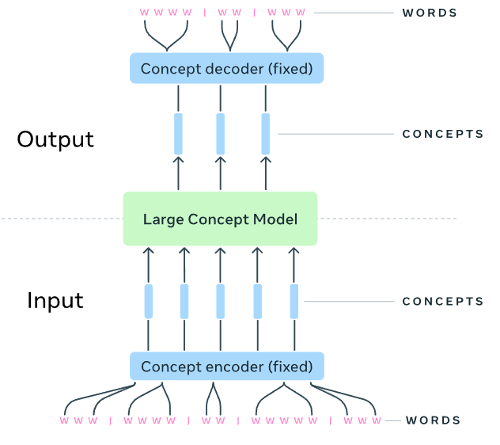
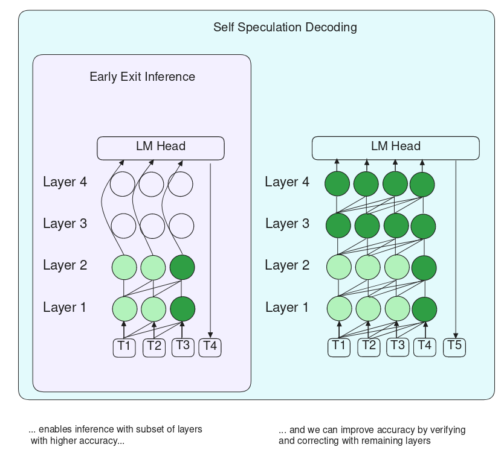

==========
AIGC model
==========

Foundation model development
----------------------------
Developing a large-scale foundation model is a challenging task due to the high computational cost and the need for large-scale data. In this section, we will introduce the key components of a foundation model and accelerate the development process with `NeMo <https://github.com/NVIDIA/NeMo>`_.

`NeMo <https://github.com/NVIDIA/NeMo>`_ is a scalable and high-performant generative AI framwork developed by NVIDIA that provides a set of tools for building large-scale foundation models (LLM, MLLM, and TTS).

.. figure:: https://docs.nvidia.com/nemo-framework/user-guide/latest/_images/nemo-llm-mm-stack.png
   :align: center

   NeMo Overview

As shown in the figure, the lifecycle of a foundation model development includes the following steps: 

- `data curation <https://github.com/NVIDIA/NeMo-Curator>`_: extract/synthetic high-quality data
- `training and customization <https://github.com/NVIDIA/NeMo-Run>`_: supervised fine-tuning and parameter-efficient fine-tuning
- `alignment <https://github.com/NVIDIA/NeMo-Aligner>`_: align the model with human values (DPO, SteerLM, RLHF)
- `deployment and inference <https://docs.nvidia.com/nemo-framework/user-guide/latest/deployment/llm/index.html#deploy-nemo-framework-models-llm>`_: TensorRT-LLM/vLLM on NVIDIA Triton inference server
- `multimodal models development <https://docs.nvidia.com/nemo-framework/user-guide/latest/multimodalmodels/index.html#>`_: multimodal llms, vision-language models, text2image and NeRF

Tutorial notebooks are listed `here <https://docs.nvidia.com/nemo-framework/user-guide/latest/playbooks/index.html>`_.

Generative model basics
--------------------------------

Taking a face generation as an example, we will introduce representative generative models and highlight their differences. The generation process aims to estimate the probability distribution of the face data :math:`p(x)`. With bayes rule, we can estimate the probability of the data given the model :math:`p(x|z)` by marginalizing over the latent variable :math:`z`:

.. math::

  p(x) = \int p(x|z)p(z) dz

**Autoencoder (AE)** models :math:`p(x)` where :math:`x` is a face. We cannot control the generated face. 

**Variational Autoencoder (VAE)** models :math:`p(x|z)` where :math:`z` is a latent continuous variable (e.g., expression).

**Vector Quantized Variational Autoencoder (VQ-VAE)** models :math:`p(x|z)` where :math:`z` is a discrete latent variable (e.g., gender).

**Autoregressive** models a joint distribution :math:`p(x_1, x_2, ..., x_T)` where :math:`x_1, x_2, ..., x_T` are the pixels of the face.

**Generative Adversarial Networks (GANs)** employs a discriminator :math:`D(x)` to distinguish the real data :math:`x` from the generated data :math:`G(z)`. The generator :math:`G(z)` tries to fool the discriminator.

**Diffusion Models** WIP

**Neural Radience Fields (NeRF)** WIP

**3D Gaussian Splatting (3DGS)** WIP

Video Foundation Model 
----------------------
Video foundation models are a type of generative model that can generate videos. They are typically trained on large-scale video datasets and can be used for various applications such as video generation, video editing, and video synthesis.

**Cosmos** `(NVIDIA Tech Report) <https://d1qx31qr3h6wln.cloudfront.net/publications/NVIDIA%20Cosmos_4.pdf>`_

Large Language Model (LLM)
---------------------------

Scaling law for training
^^^^^^^^^^^^^^^^^^^^^^^^^
Scaling law is an empirical scaling law that describes how neural network performance changes (e.g., loss :math:`L`) as key factors are scaled up or down. These factors typically include the number of parameters :math:`N`, training dataset size :math:`D`, and training cost :math:`C`. The scaling law is usually expressed as a power-law relationship between these factors and the performance metric.

.. math::

   N*(C) = A_{1} \cdot C^{\alpha_{1}}, D*(C) = A_{2} \cdot C^{\alpha_{2}}

In practice, we often conduct many experiments in a limited budget and find the compute-optimal scaling law via fitting. With the scaling law, we can predict the optimal model size :math:`N*(C)` and dataset size :math:`D*(C)` for a given compute budget :math:`C`.

.. figure:: ./images/llama3_scaling.png
   :align: center
   :alt: Ray Cluster Architecture

   Llama3 scaling law

Scaling law for inference
^^^^^^^^^^^^^^^^^^^^^^^^^
Unlike training, scaling law for inference is dependent on the model size and the inference strategy.

Milestone LLMs
^^^^^^^^^^^^^^^^^^^^^^^^^

Large language models (LLMs) have demonstrated excellent performance in various natural language processing tasks. They allow users make different tasks with simply changing the input prompt. In this section, we list some representative LLMs.

.. list-table:: 
   :header-rows: 1

   * - Name
     - Affiliation
     - Date
     - Model size
     - Model architecture
     - Pre-training
     - Post-training
     - Inference
     - Highlight
   * - `Llama3 <https://arxiv.org/pdf/2407.21783>`_
     - Llama Team, AI @ Meta
     - 2024.07
     - 8B, 70B, 405B
     - Encoder-decoder, group query attention (GQA), attention mask
     - PT (8k-2.87T token -> 128k-800B token -> 40M token using smaller lr)
     - SFT + DPO 
     - Pipeline parallelism, FP8 quantization
     - Multilingual support, multimodal support, safety migations with Llama Guard 3
   * - `Large Concept Models <https://github.com/facebookresearch/large_concept_model>`_
     - The LCM team @ Meta
     - 2024.12
     - 1.6B (1.3T token) -> 7B (2.7T token)
     - Next-sentence prediction
     - SFT + IFT (32 A100)
     - 
     - 
     - Multilingual support, multimodal support, sentence-to-sentence
   * - `DeepSeek-V3 <https://arxiv.org/pdf/2412.19437>`_
     - DeepSeek
     - 2024.12
     - Model size
     - Model architecture
     - Pre-training
     - Post-training
     - Inference
     - Highlight

   Large Concept Model

Multimodal LLMs
^^^^^^^^^^^^^^^^^^^^^^^^^

Multimodal visual-language models are divided into two categories: vision-language models and multimodal language models. Visual-language models aim to achieve zero-shot visual perception via a unified multimodal representation. Multimodal language models target to make LLMs understand and generate multimodal content.

.. list-table:: 
   :header-rows: 1

   * - Name
     - Affiliation
     - Publication
     - Category
     - Model architecture
     - Training strategy
     - Highlight
   * - `LLaVa <https://llava-vl.github.io/>`_
     - University of Wisconsin-Madison, Microsoft Research, and Columbia University
     - NeurIPS 2023
     - Multimodal language models
     - Image encoder + projector + language model
     - Instruction tuning
     - The first work to show visual capability of LLM
   * - `Spirit LM <https://arxiv.org/pdf/2402.05755>`_
     - Meta AI, Inria, Paris, EHESS, ENS-PSL, CNRS, Paris
     - under review
     - Multimodal language models
     - multimodal encoder + Llama 2 + multimodal decoder
     - Next token prediction
     - Making LLM listen and speak
   * - `NVILA <https://arxiv.org/pdf/2412.04468>`_
     - NVIDIA
     - 2024.12 arXiv preprint
     - multimodal language models
     - Model architecture
     - Training strategy
     - Highlight

Efficient transformer
----------------------

Compute-optimal transformer
^^^^^^^^^^^^^^^^^^^^^^^^^^^

**Mixture-of-Experts (MoE)** xxx

**Group Head Attention (GHA)** xxx

**FlashAtten v1** xxx

**FlashAtten v2** xxx

**FlashAtten v3** xxx

**LayerSkip** (`Elhoushi et al. <https://arxiv.org/pdf/2404.16710>`_) incorporates early exits and speculative decoding to accelerate the inference speed of transformer. It first use early layers to generate outputs and subsequently use the rest of the layers to correct the outputs. It can accelerate Llama 2 by 1.34x - 2.76x.

    ``LayerSkip`` overview

Transformer alternatives
^^^^^^^^^^^^^^^^^^^^^^^^

Transformer has dominated the large foundation models in recent years. However, its quadratic computational complexity makes it hard to inference on long contexts. To address this issue, many alternatives have been proposed. Here we list some of them.

**Mamba** (`Gu et al. <https://openreview.net/forum?id=tEYskw1VY2#discussion>`_) xxx

**Mamba2** (`Dao et al. <https://arxiv.org/abs/2405.21060>`_) xxx

References
-----------
1. Kaiming He. `6.S978 Deep Generative Models (MIT EECS, 2024 Fall). <https://mit-6s978.github.io/schedule.html>`_
2. Lilian Weng. `"What are Diffusion Models?" <https://lilianweng.github.io/posts/2021-07-11-diffusion-models/>`_ Tech Blog (2021). 
3. Elhoushi et al. `"LayerSkip: Enabling Early Exit Inference and Self-Speculative Decoding" <https://arxiv.org/pdf/2404.16710>`_ ACL 2024.