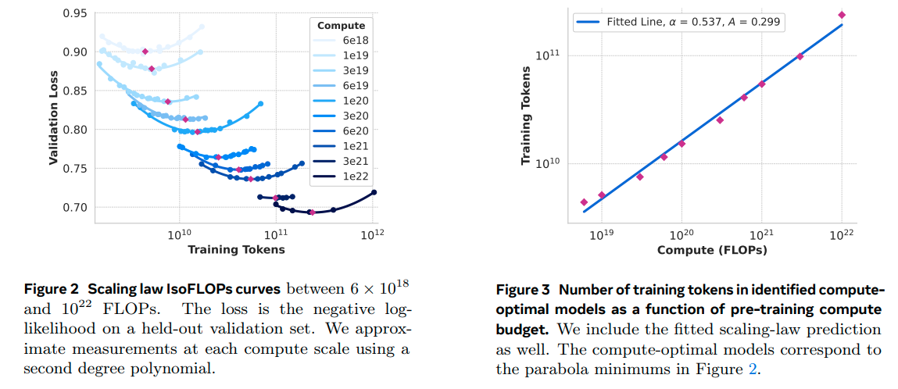

==========
AIGC model
==========

Efficient transformer
----------------------

Compute-optimal transformer
^^^^^^^^^^^^^^^^^^^^^^^^^^^

**Mixture-of-Experts (MoE)** xxx

**Group Head Attention (GHA)** xxx

**FlashAtten v1** xxx

**FlashAtten v2** xxx

**FlashAtten v3** xxx

Transformer alternatives
^^^^^^^^^^^^^^^^^^^^^^^^

Transformer has dominated the large foundation models in recent years. However, its quadratic computational complexity makes it hard to inference on long contexts. To address this issue, many alternatives have been proposed. Here we list some of them.

**Mamba** (`Gu et al. <https://openreview.net/forum?id=tEYskw1VY2#discussion>`_) xxx

**Mamba2** (`Dao et al. <https://arxiv.org/abs/2405.21060>`_) xxx

Scaling law for training
------------------------
Scaling law is an empirical scaling law that describes how neural network performance changes (e.g., loss :math:`L`) as key factors are scaled up or down. These factors typically include the number of parameters :math:`N`, training dataset size :math:`D`, and training cost :math:`C`. The scaling law is usually expressed as a power-law relationship between these factors and the performance metric.

.. math::

   N*(C) = A_{1} \cdot C^{\alpha_{1}}, D*(C) = A_{2} \cdot C^{\alpha_{2}}

In practice, we often conduct many experiments in a limited budget and find the compute-optimal scaling law via fitting. With the scaling law, we can predict the optimal model size :math:`N*(C)` and dataset size :math:`D*(C)` for a given compute budget :math:`C`.

   Llama3 scaling law

Scaling law for inference
---------------------------
Unlike training, scaling law for inference is dependent on the model size and the inference strategy.

Large language model (LLM)
--------------------------

Large language models (LLMs) have demonstrated excellent performance in various natural language processing tasks. They allow users make different tasks with simply changing the input prompt. In this section, we list some representative LLMs.

.. list-table:: 
   :header-rows: 1

   * - Name
     - Affiliation
     - Date
     - Model size
     - Model architecture
     - Pre-training
     - Post-training
     - Inference
     - Highlight
   * - `Llama3 <https://arxiv.org/pdf/2407.21783>`_
     - Llama Team, AI @ Meta
     - 2024.07
     - 8B, 70B, 405B
     - Encoder-decoder, group query attention (GQA), attention mask
     - PT (8k-2.87T token -> 128k-800B toke -> 40M token using smaller lr)
     - SFT + DPO 
     - Pipeline parallelism, FP8 quantization
     - Multilingual support, multimodal support, safety migations with Llama Guard 3
    
Multimodal models
-------------------------------

Multimodal models are divided into three categories: vision-language models, multimodal language models, and vision generation models. Visual-language models aim to achieve zero-shot visual perception via a unified multimodal representation. Multimodal language models target to make LLMs understand and generate multimodal content. Vision generation models generate images or videos from text and other modalities.

.. list-table:: 
   :header-rows: 1

   * - Name
     - Affiliation
     - Publication
     - Category
     - Model architecture
     - Training strategy
     - Highlight
   * - `CLIP <https://openai.com/blog/clip/>`_
     - OpenAI
     - ICML 2021
     - Vision-language
     - Text encoder + Image encoder
     - Contrastive learning
     - The first work to reveal zero-shot capability with multimodal constrastive learning
   * - `LLaVa <https://llava-vl.github.io/>`_
     - University of Wisconsin-Madison, Microsoft Research, and Columbia University
     - NeurIPS 2023
     - Multimodal language models
     - Image encoder + projector + language model
     - Instruction tuning
     - The first work to show visual capability of LLM
   * - `Stable Diffusion (SD) <https://arxiv.org/abs/2112.10752>`_
     - Stability AI
     - CVPR 2022
     - Vision generation
     - VAE: text encoder + diffusion (U-Net) + image decoder 
     - Reverse diffusion process
     - Text to image generation, compute-intensive (less parameters but slow)
   * - `Diffusion Transformer (DiT) <https://arxiv.org/abs/2212.09748>`_
     - UC Berkeley and New York University
     - ICCV 2023
     - Vision generation
     - VAE: text encoder + diffusion (transformer) + image decoder
     - Reverse diffusion process
     - Compute-optimal, better scaling

Generative model basics
--------------------------------

Taking a face generation as an example, we will introduce representative generative models and highlight their differences. The generation process aims to estimate the probability distribution of the face data :math:`p(x)`. With bayes rule, we can estimate the probability of the data given the model :math:`p(x|z)` by marginalizing over the latent variable :math:`z`:

.. math::

  p(x) = \int p(x|z)p(z) dz

**Autoencoder (AE)** models :math:`p(x)` where :math:`x` is a face. We cannot control the generated face. 

**Variational Autoencoder (VAE)** models :math:`p(x|z)` where :math:`z` is a latent continuous variable (e.g., expression).

**Vector Quantized Variational Autoencoder (VQ-VAE)** models :math:`p(x|z)` where :math:`z` is a discrete latent variable (e.g., gender).

**Autoregressive** models a joint distribution :math:`p(x_1, x_2, ..., x_T)` where :math:`x_1, x_2, ..., x_T` are the pixels of the face.

**Generative Adversarial Networks (GANs)** employs a discriminator :math:`D(x)` to distinguish the real data :math:`x` from the generated data :math:`G(z)`. The generator :math:`G(z)` tries to fool the discriminator.

**Diffusion Models** TBD
