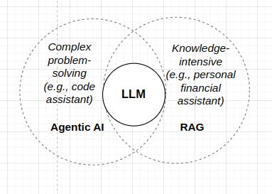
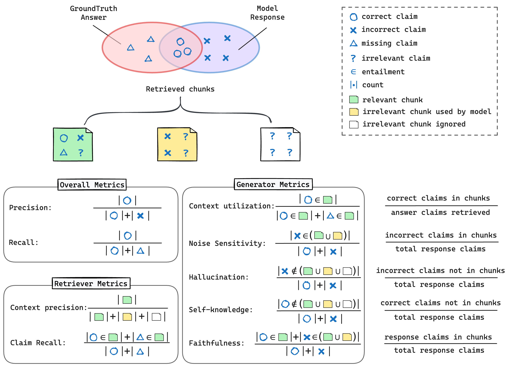
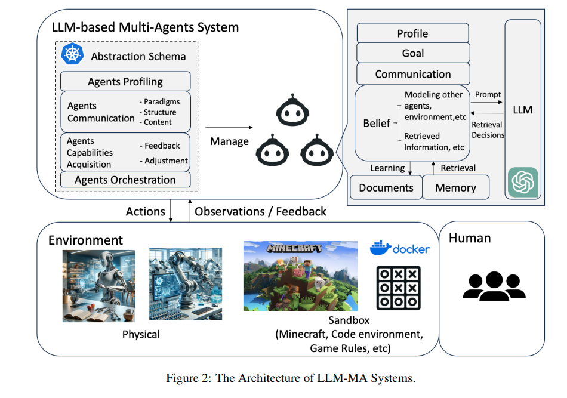

================
LLM applications
================
Large language models (LLMs) have demonstrated remarkable capabilities in various domains. However, building a real-world application with LLMs can be challenging due to their hallucinations and outdated knowledge. To address these issues, retrieval-augmented generation (RAG) and agentic AI have been employed. In this note, we will introduce them and provide a hands-on recipe to build a AI assistant and a AI scientist.

After reading this note, you will be able to:

- Understand the limitations of LLMs and how RAG and agentic AI can help.
- Build a AI assistant with native LLM API calling.

LLM and its limitations
------------------------
Large Language Models (LLMs) are proficient in generating text that is coherent and contextually relevant. However, they have a tendency to produce information that is not grounded in factual evidence or prior knowledge, a phenomenon known as hallucination. This can result in the generation of inaccurate or misleading information.

For knowledge-intensive tasks, LLMs alone may not be sufficient. To address this limitation, the Retrieval-Augmented Generation (RAG) model is proposed. RAG enhances the capabilities of LLMs by incorporating external knowledge sources, such as databases or knowledge graphs, to provide more accurate and reliable information.

In addition, some tasks require reasoning and the use of other tools, such as code interpreters, which can be challenging for LLMs to handle independently. To tackle this, the concept of agentic AI is introduced. Agentic AI refers to AI systems that can take initiative, make decisions, and perform actions in a goal-directed manner. By integrating agentic AI with LLMs, it becomes possible to handle complex tasks that involve reasoning and the use of external tools more effectively.

    LLM applications

RAG
----
RAG aims to leverage the external knowledge to help LLM answer questions. It consists of two components: a retriever and a generator. The retriever is responsible for retrieving relevant documents from a knowledge base, while the generator is responsible for generating the answer based on the retrieved documents.

.. figure:: https://weaviate.io/assets/images/Vanilla_RAG-697535e2d5b9ae64ccfd6415a79965c7.png
    :align: center
    :alt: Ray Cluster Architecture

    RAG workflow (`Weaviate <https://weaviate.io/blog/retrieval-augmented-generation/>`_)

Fine-tuning vs. RAG
^^^^^^^^^^^^^^^^^^^^
A strightforward approach to improve LLMs is fine-tuning. However, fine-tuning requires a large amount of labeled data and is computationally expensive. In contrast, RAG provides a more efficient way to **inject new knowledge** into LLMs. 

Measurements of RAG
^^^^^^^^^^^^^^^^^^^^
Based on the workflow of RAG, we often measure the performance from two aspects: the quality of the retrieved documents and the quality of the generated answer.

    RAGChecker Metrics (`RAGChecker <https://github.com/ragchecker/ragchecker>`_)

Challenges for RAG
^^^^^^^^^^^^^^^^^^^^
1. **Unreliable information retrieval**: LLMs are sensistive to the provided context information. Irrelevant or misleading retrieval results can lead to poor performance.
    - Misleading user queries
    - Wrong ranks of retrieved documents
2. **Time-consuming inference**: retrieval will add additional time to the inference process.
    - Iterative retrievals
    - Long context for LLMs

Recent advancements
^^^^^^^^^^^^^^^^^^^^

**Graph-based RAG** employs a knowledge graph to improve the retrieval process. It can reduce the number of retrieved documents and improve the quality of the retrieved documents. Popular implementations include `GraphRAG <https://github.com/microsoft/graphrag>`_ and `LightRAG <https://github.com/HKUDS/LightRAG>`_.

**Self-RAG** (`Asai et al. <https://arxiv.org/abs/2310.11511>`_) uses a tuned LLM to decide whether to retrieve documents or not and whether the retrieval results are reliable. It boost naive RAG by more than 10% in accuracy.

**Agentic RAG** extends Self-RAG to multi-agent systems. It decompose user queries into sub-queries and assign different agents to handle different sub-queries. It can handle more complex tasks and improve the performance of RAG.

.. figure:: https://weaviate.io/assets/images/Multi_Agent_RAG_System-73e480f62a52e172a78a0ac344dcdcb5.png
    :align: center
    :alt: Ray Cluster Architecture

    Multi-agent RAG (`Weaviate. <https://weaviate.io/blog/what-is-agentic-rag>`_)

**xRAG** (`Chen et al. <https://arxiv.org/abs/2405.13792>`_) compress long contexts into a single token for LLM. It can reduce the memory footprint significantly and speedup the inference of LLMs.

Agentic AI
-----------
Agentic AI (`Lilian Weng. <https://lilianweng.github.io/posts/2023-06-23-agent/>`_) powered by LLMs uses LLMs as a controller to complete tasks. It consists of four components: planer, memory, tool use, and action.

.. figure:: https://lilianweng.github.io/posts/2023-06-23-agent/agent-overview.png
    :align: center
    :alt: Ray Cluster Architecture

    Agent overview

**Single agent** (`Li et al. <https://arxiv.org/abs/2401.05459>`_) aims to complete a task by itself. It often simulates human behavior and uses LLM's reasoning ability to decompose the task into smaller sub-tasks. Subsequently, it uses external tools to complete all the sub-tasks and generate the final answer. It is only working for simple tasks (e.g., handle misleading user queries).

**Multi-agent AI** (`Guo et al. <https://arxiv.org/pdf/2402.01680>`_) leverages collective intelligence of multiple agents to complete complex tasks (e.g., develop a software product and write a research eassy). The workflow contains three phrases: decompose the goal with sub-tasks, build an agent for each task, and coordinate the agents to complete the goal. 

    Multi-agent system overview

Recipe for AI assistant
------------------------
This tutorial will guide you through building a AI assistant using `LlamaIndex <https://github.com/run-llama/llama_index>`_.

Recipe for AI scientist
------------------------
This tutorial will guide you through building a AI scientist using `CrewAI <https://github.com/crewAIInc/crewAI>`_.

References
-----------
1. Microsoft. `"GraphRAG: A modular graph-based Retrieval-Augmented Generation (RAG) system" <https://github.com/microsoft/graphrag>`_ Github repo.
2. HKUDS. `"LightRAG: Simple and Fast Retrieval-Augmented Generation" <https://github.com/HKUDS/LightRAG>`_ Github repo.
3. Asai et al. `"Self-RAG: Learning to Retrieve, Generate, and Critique through Self-Reflection" <https://arxiv.org/abs/2310.11511>`_ ICLR 2024.
4. Chen et al. `"xRAG: Extreme Context Compression for Retrieval-augmented Generation with One Token" <https://arxiv.org/abs/2405.13792>`_ Neurips 2024.
5. Lilian Weng. `"LLM Powered Autonomous Agents" <https://lilianweng.github.io/posts/2023-06-23-agent/>`_ Tech blog (2023).
6. Li et al. `"Personal LLM Agents: Insights and Survey about the Capability, Efficiency and Security" <https://arxiv.org/abs/2401.05459>`_ arXiv preprint arXiv:2401.05459 (2024).
7. Guo et al. `"Large Language Model based Multi-Agents: A Survey of Progress and Challenges" <https://arxiv.org/pdf/2402.01680>`_ IJCAI 2024.
8. run-llama. `"LlamaIndex is a data framework for your LLM applications" <https://github.com/run-llama/llama_index>`_ Github repo.
9. crewAIInc. `"CrewAI: Cutting-edge framework for orchestrating role-playing, autonomous AI agents" <https://github.com/crewAIInc/crewAI>`_ Github repo.
