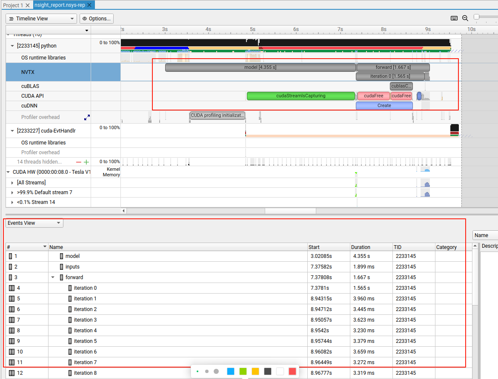

==========
PyTorch
==========
PyTorch is an open-source machine learning library based on the Torch library, used for applications such as computer vision and natural language processing, primarily developed by Facebook's AI Research lab. It is free and open-source software released under the Modified BSD license.

Useful Links:

- `ProjectPage Template (Nerfies) <https://github.com/nerfies/nerfies.github.io>`_
- `Pytorch Lightning code guideline for conferences <https://github.com/Lightning-AI/deep-learning-project-template>`_
- `PyTorch Experiments Template (TorchRecipes) <https://github.com/facebookresearch/recipes>`_
- `Model Graph Visualizer and Debugger (Model Explorer) <https://github.com/google-ai-edge/model-explorer>`_

Model visualization
-------------------
``Model Explorer`` provides a web-based interface for visualizing and debugging PyTorch models. You can use the following code to visualize any PyTorch model.

.. code-block:: python

    # pip install ai-edge-model-explorer
    import model_explorer
    import torch
    import torchvision

    # Prepare a PyTorch model and its inputs.
    model = torchvision.models.mobilenet_v2().eval()
    inputs = (torch.rand([1, 3, 224, 224]),)
    ep = torch.export.export(model, inputs)

    # Visualize.
    model_explorer.visualize_pytorch('mobilenet', exported_program=ep)

torch.compile
-----------------

``torch.compile`` is a new feature in PyTorch that allows users to compile their models for faster training and inference. In practice, it can speed up model inference at least 30%.

.. figure:: https://pytorch.org/assets/images/pytorch-2.0-img4.jpg
    :align: center
    :alt: Ray Cluster Architecture

    ``torch.compile`` workflow

The process begins with ``torch.compile`` taking a PyTorch model as input. It then utilizes ``TorchDynamo`` and ``AOTAutograd`` to generate execution graphs for both the forward and backward passes. Next, each operator within the graph is mapped to a manually optimized operator from either ``ATen`` or ``Prim IR``. Finally, ``TorchInductor`` compiles the generated graphs and produces execution Triton code for the GPU and C++/OpenMP code for the CPU.

Use ``torch.compile`` is simple. Just wrap your model with ``torch.compile`` and it will automatically compile your model for faster training and inference.

.. code-block:: python

    # option 1: using torch.compile
    import torch
    mod = MyModule()
    opt_mod = torch.compile(mod)

    # option 2: using @torch.compile warp your code 
    t1 = torch.randn(10, 10)
    t2 = torch.randn(10, 10)

    @torch.compile
    def opt_foo2(x, y):
        a = torch.sin(x)
        b = torch.cos(y)
        return a + b
    print(opt_foo2(t1, t2))

``torch.compile`` has integrated with `Torch-TensorRT <https://github.com/pytorch/TensorRT>`_ and enables users to compile their models with ``TensorRT`` backend for faster inference.

.. code-block:: python

    # pip install torch-tensorrt
    import torch
    import timeit
    import torch_tensorrt

    model = MyModel().eval().cuda() # define your model here
    x = torch.randn((1, 3, 224, 224)).cuda() # define what the inputs to the model will look like

    optimized_model = torch.compile(model, backend="tensorrt")
    optimized_model(x) # compiled on first run

    optimized_model(x) # this will be fast!
    
    # Tesla V100 32GB
    # >>> timeit.timeit('model(x)', number=10, globals=globals())
    # 0.10089640901423991
    # >>> timeit.timeit('optimized_model(x)', number=10, globals=globals())
    # 0.04496749211102724

PyTorch profiling
----------------------

Use PyTorch Profile
^^^^^^^^^^^^^^^^^^^^
PyTorch Profile provides a fine-grained view of the performance of your PyTorch code. It can help you identify bottlenecks (e.g., slow operations) and optimize your code accordingly.

.. code-block:: python
    
    import torch
    import torchvision.models as models
    from torch.profiler import profile, record_function, ProfilerActivity

    model = models.resnet18()
    inputs = torch.randn(5, 3, 224, 224)

    # ProfilerActivity.CPU, ProfilerActivity.CUDA
    with profile(activities=[ProfilerActivity.CPU],
            profile_memory=True, record_shapes=True) as prof:
        model(inputs)

    # self_cpu_time_total, self_cuda_time_total, self_cpu_memory_usage
    print(prof.key_averages().table(sort_by="self_cpu_memory_usage", row_limit=10))

You can also use ``pytorch_benchmark`` to profile the whole inference workload.

.. code-block:: python

    # pip install pytorch-benchmark
    from pytorch_benchmark import benchmark
    
    model = models.resnet18().to("cuda")
    inputs = torch.randn(8, 3, 224, 224).to("cuda")

    results = benchmark(model, inputs, num_runs=100)

Sample results:

.. code-block:: bash
    
    {'machine_info': {'system': {'system': 'Linux',
    'node': 'ubuntu20',
    'release': '5.4.0-200-generic'},
    'cpu': {'model': 'Intel(R) Xeon(R) Gold 6248R CPU @ 3.00GHz',
    'architecture': 'x86_64',
    'cores': {'physical': 9, 'total': 18},
    'frequency': '0.00 GHz'},
    'memory': {'total': '57.15 GB', 'used': '9.17 GB', 'available': '47.27 GB'},
    'gpus': [{'name': 'Tesla V100S-PCIE-32GB', 'memory': '32768.0 MB'},
    {'name': 'Tesla V100S-PCIE-32GB', 'memory': '32768.0 MB'}]},
    'device': 'cuda',
    'params': 11689512,
    'flops': 1822177768,
    'timing': {'batch_size_1': {'on_device_inference': {'metrics': {'batches_per_second_mean': -0.3533214991294893,
        'batches_per_second_std': 0.024314445753960502,
        'batches_per_second_min': -0.3696649900451516,
        'batches_per_second_max': -0.1583176335697835,
        'seconds_per_batch_mean': -2.8545052862167357,
        'seconds_per_batch_std': 0.36834380372350745,
        'seconds_per_batch_min': -6.316415786743164,
        'seconds_per_batch_max': -2.7051520347595215},
        'human_readable': {'batches_per_second': '-0.35 +/- 0.02 [-0.37, -0.16]',
        'batch_latency': '-2854505.286 us +/- 368.344 ms [-6316415.787 us, -2705152.035 us]'}},
    'cpu_to_gpu': {'metrics': {'batches_per_second_mean': 3642.634925121181,
        'batches_per_second_std': 290.7311815052623,
    ...
    'max_inference_bytes': 165828608,
    'post_inference_bytes': 108468224,
    'pre_inference': '103.44 MB',
    'max_inference': '158.15 MB',
    'post_inference': '103.44 MB'}}}

Use NVIDIA Nsight Systems
^^^^^^^^^^^^^^^^^^^^^^^^^

NVIDIA Nsight Systems provides a **timeline** view of your PyTorch code, allowing you to visualize the performance of your model and identify bottlenecks.

.. code-block:: bash

    # test_nsys.py
    import torch
    import torchvision.models as models
    #from torch.profiler import profile, record_function, ProfilerActivity

    torch.cuda.nvtx.range_push("model")
    model = models.resnet18(pretrained=True).cuda()
    torch.cuda.nvtx.range_pop()

    torch.cuda.nvtx.range_push("inputs")
    inputs = torch.randn(1, 3, 224, 224).cuda()
    torch.cuda.nvtx.range_pop()
    model.eval()

    torch.cuda.nvtx.range_push("forward")
    with torch.no_grad():
        for i in range(30):
            torch.cuda.nvtx.range_push(f"iteration {i}")
            model(inputs)
            torch.cuda.nvtx.range_pop()
            
    torch.cuda.nvtx.range_pop()

Execute the code with ``nsys``:

.. code-block:: bash

    nsys profile -w true -t cuda,nvtx,osrt,cudnn,cublas -s none -o nsight_report -f true -x true python test_nsys.py

You can view the results in the NVIDIA Nsight Systems GUI.

   Nsys example

As illustrated in the figure above, the first inference iteration is slow due to the warmup phase (e.g., allocating GPU resource via ``cudaFree``). The subsequent iterations are faster.

Use PyTorch Lightning
----------------------

`PyTorch Lightning <https://github.com/Lightning-AI/pytorch-lightning>`_ provides a lightweight PyTorch wrapper to help researchers and practitioners streamline their code and make it more readable and maintainable.

Define the training workflow. Here's a toy example:

.. code-block:: python

    # main.py
    # ! pip install torchvision
    import torch, torch.nn as nn, torch.utils.data as data, torchvision as tv, torch.nn.functional as F
    import lightning as L
    from lightning import loggers

    # --------------------------------
    # Step 1: Define a LightningModule
    # --------------------------------
    # A LightningModule (nn.Module subclass) defines a full *system*
    # (ie: an LLM, diffusion model, autoencoder, or simple image classifier).

    class LitAutoEncoder(L.LightningModule):
        def __init__(self):
            super().__init__()
            self.encoder = nn.Sequential(nn.Linear(28 * 28, 128), nn.ReLU(), nn.Linear(128, 3))
            self.decoder = nn.Sequential(nn.Linear(3, 128), nn.ReLU(), nn.Linear(128, 28 * 28))

        def forward(self, x):
            # in lightning, forward defines the prediction/inference actions
            embedding = self.encoder(x)
            return embedding

        def training_step(self, batch, batch_idx):
            # training_step defines the train loop. It is independent of forward
            x, _ = batch
            x = x.view(x.size(0), -1)
            z = self.encoder(x)
            x_hat = self.decoder(z)
            loss = F.mse_loss(x_hat, x)
            self.log("train_loss", loss)
            return loss

        def validation_step(self, batch, batch_idx):
            # this is the validation loop
            x, _ = batch
            x = x.view(x.size(0), -1)
            z = self.encoder(x)
            x_hat = self.decoder(z)
            val_loss = F.mse_loss(x_hat, x)
            self.log("val_loss", val_loss)

        def test_step(self, batch, batch_idx):
            # this is the test loop
            x, _ = batch
            x = x.view(x.size(0), -1)
            z = self.encoder(x)
            x_hat = self.decoder(z)
            test_loss = F.mse_loss(x_hat, x)
            self.log("test_loss", test_loss)

        def configure_optimizers(self):
            optimizer = torch.optim.Adam(self.parameters(), lr=1e-3)
            return optimizer

    # -------------------
    # Step 2: Define data
    # -------------------
    dataset = tv.datasets.MNIST(".", download=True, transform=tv.transforms.ToTensor())
    train, val = data.random_split(dataset, [55000, 5000])

    # -------------------
    # Step 3: Train
    # -------------------
    autoencoder = LitAutoEncoder()
    trainer = L.Trainer(accelerator="gpu", devices=8, logger=TensorBoardLogger("logs/"))
    # trainer.test(model, dataloaders=DataLoader(test_set))
    trainer.fit(autoencoder, data.DataLoader(train), data.DataLoader(val))

Run the model on your terminal

.. code-block:: bash

    pip install torchvision
    python main.py

Export to torchscript (JIT)

.. code-block:: python

    # torchscript
    autoencoder = LitAutoEncoder()
    torch.jit.save(autoencoder.to_torchscript(), "model.pt")

Export to ONNX

.. code-block:: python

    # onnx
    with tempfile.NamedTemporaryFile(suffix=".onnx", delete=False) as tmpfile:
        autoencoder = LitAutoEncoder()
        input_sample = torch.randn((1, 64))
        autoencoder.to_onnx(tmpfile.name, input_sample, export_params=True)
        os.path.isfile(tmpfile.name)

Develop a reusable datamodule

.. code-block:: python
    
    import lightning as L
    from torch.utils.data import random_split, DataLoader

    # Note - you must have torchvision installed for this example
    from torchvision.datasets import MNIST
    from torchvision import transforms

    class MNISTDataModule(L.LightningDataModule):
        def __init__(self, data_dir: str = "./"):
            super().__init__()
            self.data_dir = data_dir
            self.transform = transforms.Compose([transforms.ToTensor(), transforms.Normalize((0.1307,), (0.3081,))])

        def prepare_data(self):
            # download
            MNIST(self.data_dir, train=True, download=True)
            MNIST(self.data_dir, train=False, download=True)

        def setup(self, stage: str):
            # Assign train/val datasets for use in dataloaders
            if stage == "fit":
                mnist_full = MNIST(self.data_dir, train=True, transform=self.transform)
                self.mnist_train, self.mnist_val = random_split(
                    mnist_full, [55000, 5000], generator=torch.Generator().manual_seed(42)
                )

            # Assign test dataset for use in dataloader(s)
            if stage == "test":
                self.mnist_test = MNIST(self.data_dir, train=False, transform=self.transform)

            if stage == "predict":
                self.mnist_predict = MNIST(self.data_dir, train=False, transform=self.transform)

        def train_dataloader(self):
            return DataLoader(self.mnist_train, batch_size=32)

        def val_dataloader(self):
            return DataLoader(self.mnist_val, batch_size=32)

        def test_dataloader(self):
            return DataLoader(self.mnist_test, batch_size=32)

        def predict_dataloader(self):
            return DataLoader(self.mnist_predict, batch_size=32)

Use the datamodule

.. code-block:: python

    dm = MNISTDataModule()
    model = Model()
    trainer.fit(model, datamodule=dm)
    trainer.test(datamodule=dm)
    trainer.validate(datamodule=dm)
    trainer.predict(datamodule=dm)

Find training loop bottlenecks

.. code-block:: python

    trainer = Trainer(profiler="simple")

.. code-block:: bash

    FIT Profiler Report

    -------------------------------------------------------------------------------------------
    |  Action                                          |  Mean duration (s) |  Total time (s) |
    -------------------------------------------------------------------------------------------
    |  [LightningModule]BoringModel.prepare_data       |  10.0001           |  20.00          |
    |  run_training_epoch                              |  6.1558            |  6.1558         |
    |  run_training_batch                              |  0.0022506         |  0.015754       |
    |  [LightningModule]BoringModel.optimizer_step     |  0.0017477         |  0.012234       |
    |  [LightningModule]BoringModel.val_dataloader     |  0.00024388        |  0.00024388     |
    |  on_train_batch_start                            |  0.00014637        |  0.0010246      |
    |  [LightningModule]BoringModel.teardown           |  2.15e-06          |  2.15e-06       |
    |  [LightningModule]BoringModel.on_train_start     |  1.644e-06         |  1.644e-06      |
    |  [LightningModule]BoringModel.on_train_end       |  1.516e-06         |  1.516e-06      |
    |  [LightningModule]BoringModel.on_fit_end         |  1.426e-06         |  1.426e-06      |
    |  [LightningModule]BoringModel.setup              |  1.403e-06         |  1.403e-06      |
    |  [LightningModule]BoringModel.on_fit_start       |  1.226e-06         |  1.226e-06      |
    -------------------------------------------------------------------------------------------

