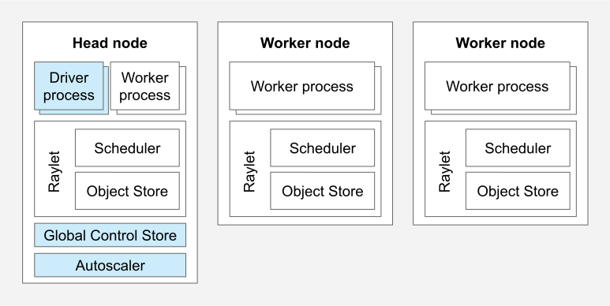
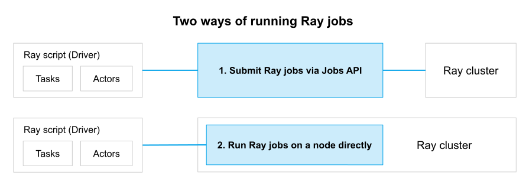
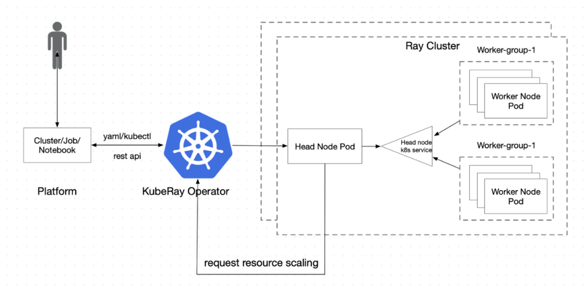

=========
Ray
=========

Ray is a powerful, unified distributed framework designed to handle a wide range of AI workloads. It provides the tools and infrastructure necessary to build a scalable AI platform that supports various stages of the machine learning lifecycle, including training, inference, and serving models. By leveraging Ray, developers can efficiently manage and scale their AI applications, ensuring optimal performance and resource utilization.

Ray Cluster (AI platform)
-------------------------

Ray Cluster, a feature of the Ray framework, offers a scalable and flexible solution for deploying and managing AI applications on Kubernetes. It is comprised of two main components:

- **Ray Head Node**: This is the master node of the Ray cluster, responsible for managing the cluster and scheduling tasks.
- **Ray Worker Nodes**: These are the worker nodes of the Ray cluster, responsible for executing tasks and storing data.

By leveraging Ray Cluster, users can efficiently manage and scale their AI workloads within a Kubernetes environment.

Ray Cluster simplifies the deployment and management of AI applications, offering users the convenience of utilizing the ray job SDK for seamless operations.

Install Ray Cluster
^^^^^^^^^^^^^^^^^^^^
.. code:: bash

    pip install 'ray[default]'

Use kuberay to manage Ray Clusters
^^^^^^^^^^^^^^^^^^^^^^^^^^^^^^^^^^^^^^^

To efficiently manage multiple Ray clusters within a single Kubernetes cluster, we can utilize KubeRay, a Kubernetes-native operator specifically designed for this purpose. Each Ray cluster is composed of a head node pod and a set of worker node pods, allowing for the deployment and organization of different AI projects in a streamlined manner.

.. note::
    Using KubeRay, deploying and managing multiple Ray clusters within a single Kubernetes cluster becomes efficient. Each Ray cluster can be designated for deploying distinct AI projects, enabling streamlined organization and resource management.

Preparation: install kubectl, helm, kind and docker
""""""""""""""""""""""""""""""""""""""""""""""""""""""""""""""""""""""""""""""""""""""""""""""""""""""""""""""""""""""""""""""""""""""""""""""""""""""""""""""""""""""""""""""""""""""""""""""""""""""""""""""""""""""""
.. code:: bash

    # install kubectl
    curl -LO "https://dl.k8s.io/release/$(curl -L -s https://dl.k8s.io/release/stable.txt)/bin/linux/amd64/kubectl"
    sudo install -o root -g root -m 0755 kubectl /usr/local/bin/kubectl
    kubectl version --client

    # install helm
    curl -fsSL -o get_helm.sh https://raw.githubusercontent.com/helm/helm/main/scripts/get-helm-3
    chmod 700 get_helm.sh
    ./get_helm.sh
    helm version

    # install kind
    [ $(uname -m) = x86_64 ] && curl -Lo ./kind https://kind.sigs.k8s.io/dl/v0.25.0/kind-linux-amd64
    chmod +x ./kind
    sudo mv ./kind /usr/local/bin/kind

    # install docker
    systemctl stop docker

    apt-get remove docker docker-engine docker.io containerd runc

    apt-get -y autoremove  &&  apt-get clean

    curl -fsSL https://download.docker.com/linux/ubuntu/gpg | gpg --dearmor -o /usr/share/keyrings/docker-archive-keyring.gpg

    echo "deb [arch=amd64 signed-by=/usr/share/keyrings/docker-archive-keyring.gpg] https://download.docker.com/linux/ubuntu $(lsb_release -cs) stable" | tee /etc/apt/sources.list.d/docker.list

    aptitude update

    aptitude install -y docker-ce docker-ce-cli containerd.io

.. note::
    For Chinese users, you have to use VPN to setup network environment, otherwise, you will meet some timeout issues. 
    
    Assume that you have already installed VPN (127.0.0.1:7890). 
    
    1. Set environment variables as follows:

    .. code:: bash

        export http_proxy=http://127.0.0.1:7890
        export https_proxy=http://127.0.0.1:7890
        export all_proxy=socks5://127.0.0.1:7890
    
    2. `Setup proxy for docker <https://ml-engineer.readthedocs.io/en/latest/k8s.html#setup-proxy-for-docker>`_
    
Step 1: Create a Kubernetes cluster
""""""""""""""""""""""""""""""""""""
.. code:: bash

    # create a default cluster named kind
    kind create cluster --image=kindest/node:v1.26.0 
    
    # pull images
    docker pull quay.io/kuberay/operator:v1.2.2 
    docker pull docker.io/rayproject/ray:2.9.0 
    
    # load images to kind cluster
    kind load docker-image quay.io/kuberay/operator:v1.2.2 --name kind 
    kind load docker-image rayproject/ray:2.9.0 --name kind     

Step 2: Deploy a KubeRay operator
""""""""""""""""""""""""""""""""""""
.. code:: bash

    helm repo add kuberay https://ray-project.github.io/kuberay-helm/
    helm repo update

    # Install both CRDs and KubeRay operator v1.2.2.
    helm install kuberay-operator kuberay/kuberay-operator --version 1.2.2

    # Confirm that the operator is running in the namespace `default`.
    kubectl get pods
    # NAME                                READY   STATUS    RESTARTS   AGE
    # kuberay-operator-7fbdbf8c89-pt8bk   1/1     Running   0          27s

Step 3: Deploy a RayCluster custom resource
""""""""""""""""""""""""""""""""""""""""""""""""
.. code:: bash

    # Deploy a sample RayCluster CR from the KubeRay Helm chart repo:
    helm install raycluster kuberay/ray-cluster --version 1.2.2

    # Once the RayCluster CR has been created, you can view it by running:
    kubectl get rayclusters

    # NAME                 DESIRED WORKERS   AVAILABLE WORKERS   CPUS   MEMORY   GPUS   STATUS   AGE
    # raycluster-kuberay   1                 1                   2      3G       0      ready    95s

    # View the pods in the RayCluster named "raycluster-kuberay"
    kubectl get pods --selector=ray.io/cluster=raycluster-kuberay

    # NAME                                          READY   STATUS    RESTARTS   AGE
    # raycluster-kuberay-head-vkj4n                 1/1     Running   0          XXs
    # raycluster-kuberay-worker-workergroup-xvfkr   1/1     Running   0          XXs

.. note::
    You can check running logs via ``kubectl describe pods raycluster-kuberay``.

Step 4: Run an application on a RayCluster
""""""""""""""""""""""""""""""""""""""""""""""""
.. code:: bash

    kubectl get service raycluster-kuberay-head-svc

    # NAME                          TYPE        CLUSTER-IP    EXTERNAL-IP   PORT(S)                                         AGE
    # raycluster-kuberay-head-svc   ClusterIP   10.96.93.74   <none>        8265/TCP,8080/TCP,8000/TCP,10001/TCP,6379/TCP   15m

    # Execute this in a separate shell.
    kubectl port-forward service/raycluster-kuberay-head-svc 8265:8265

    # The following job's logs will show the Ray cluster's total resource capacity, including 2 CPUs.
    ray job submit --address http://localhost:8265 -- python -c "import ray; ray.init(); print(ray.cluster_resources())"

Step 5: Access the Ray Dashboard
""""""""""""""""""""""""""""""""""""
View ``127.0.0.1:8625`` in your browser.

Step 6: Cleanup 
""""""""""""""""""""""""
.. code:: bash

    # [Step 6.1]: Delete the RayCluster CR
    # Uninstall the RayCluster Helm chart
    helm uninstall raycluster
    # release "raycluster" uninstalled

    # Note that it may take several seconds for the Ray pods to be fully terminated.
    # Confirm that the RayCluster's pods are gone by running
    kubectl get pods

    # NAME                                READY   STATUS    RESTARTS   AGE
    # kuberay-operator-7fbdbf8c89-pt8bk   1/1     Running   0          XXm

    # [Step 6.2]: Delete the KubeRay operator
    # Uninstall the KubeRay operator Helm chart
    helm uninstall kuberay-operator
    # release "kuberay-operator" uninstalled

    # Confirm that the KubeRay operator pod is gone by running
    kubectl get pods
    # No resources found in default namespace.

    # [Step 6.3]: Delete the Kubernetes cluster
    kind delete cluster

Submit a training job
^^^^^^^^^^^^^^^^^^^^^^^^^^^^^^^^^^^^

xxx

Submit a inference job
^^^^^^^^^^^^^^^^^^^^^^^^^^^^^^^^^^^^^

xxx

Submit a serving job
^^^^^^^^^^^^^^^^^^^^^^^^^^^^^^^^^^^

xxx

Ray Train (distributed training)
--------------------------------
xxx

Ray Serve (inference server)
----------------------------
xxx

Known Issues
-------------
xxx