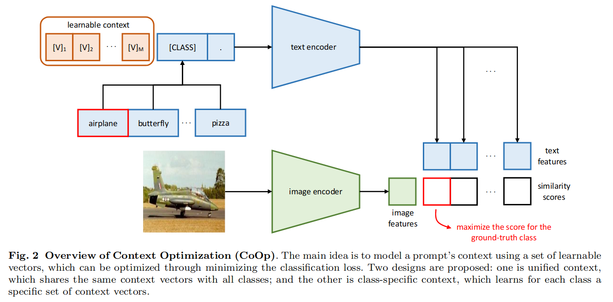
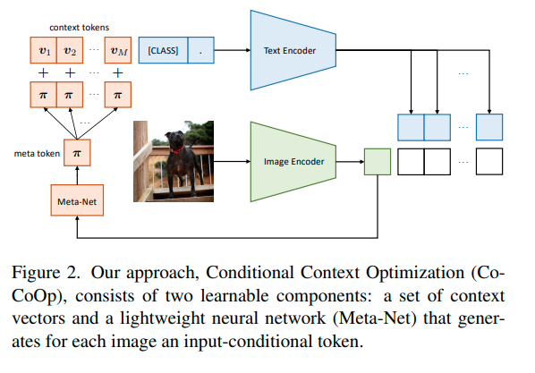

=================
Vision perception
=================
Vision perception aims to understand the environment through images and videos. Driven by cross-modal learning and multimodal models, vision perception models have zero-shot capabilities and thus can be applied to many different tasks. In this section, we will introduce some popular vision perception models and their optimization methods.

Vision foundation models
-------------------------
.. list-table:: 
   :header-rows: 1

   * - Name
     - Affiliation
     - Publication
     - Model architecture
     - Training strategy
     - Highlight
   * - CLIP
     - OpenAI
     - ICML 2021
     - Text & Vison encoder
     - Image-text contrastive pre-training, 400M image-text pairs
     - Zero-shot on image classification
   * - SAM
     - Meta AI
     - ICCV 2023
     - Image encoder (MAE) + prompt encoder + mask decoder
     - Supervised pre-training, 11B images
     - Zero-shot on image segmentation & unified prompt encoder
   * - EfficientSAM
     - Meta AI
     - CVPR 2024
     - Same to SAM 
     - Reconstructing features from image encoder
     - ~80FPS on A100
   * - YOLO-World
     - Tencent AI Lab, Tencent PCG, and Huazhong University of Science & Technology
     - CVPR 2024
     - Text & vision encoder & cross-modal fusion module
     - Constrastive learning + object detection, 1.6M images
     - 52 FPS on V100
   * - SAM 2
     - Meta AI
     - ICLR 2025
     - SAM + Memory module
     - Supervised pre-training on 196 hours videos
     - 6x speedup compared with image-based SAM

**CLIP** (`Radford et al. <https://arxiv.org/pdf/2103.00020>`_) is the first work to present zero-shot image classification through image-vision contrastive pre-training. The model employs two encoders, one for images and the other for texts, and learns to map images and texts into a shared space where the similarity between them can be measured. Instead of using existing small datasets, authors have created a large-scale dataset containing 400M image-text pairs for pre-training.

.. figure:: https://github.com/openai/CLIP/raw/main/CLIP.png
   :align: center
   :alt: CLIP architecture
   
   CLIP Overview

**SAM** (`Kirillov et al. <https://arxiv.org/pdf/2304.02643>`_) proposes a zero-shot segmentation model which enable text, point, bounding box, and mask prompts. The model consists of a Masked Auto-Encoder (MAE) image encoder, a prompt encoder, and a mask decoder. The model is pre-trained on 11B images and achieves state-of-the-art performance on zero-shot image segmentation.

.. figure:: https://github.com/facebookresearch/segment-anything/blob/main/assets/model_diagram.png?raw=true
   :align: center

   SAM Overview

**EfficientSAM** (`Xiong et al. <https://arxiv.org/abs/2312.00863>`_) further improves computation-efficiency of SAM by compressing a heavy image encoder to a lightweight vision encoder. In specific, EfficientSAM learns a lightweight vision encoder by reconstructing features from the original image encoder. The model achieves 80+ FPS on A100.

.. figure:: https://yformer.github.io/efficient-sam/EfficientSAM_files/overview.png
    :align: center

    EfficientSAM Overview

**YOLO-World** (`Cheng et al. <https://arxiv.org/abs/2401.17270>`_) is the first work to explore zero-shot object detetcion with a lightweight backbone (YOLOv8). The model contains a text encoder, a vision encoder, and a cross-modal fusion module. Cross-modal fusion module is used to enhance the features from text and vision encoders and generate the final object detection results. It achieves 52 FPS on V100.

.. figure:: https://www.yoloworld.cc/images/yolo_arch.png
   :align: center

   YOLO-World Overview

**SAM 2** (`Ravi et al. <https://arxiv.org/abs/2408.00714>`_) extends SAM to support video segmentation and introduces a streaming memory for real-time video processing. The model is pre-trained on a new large-scale dataset named SA-V (50.9K videos & 196 hours).

.. figure:: https://github.com/facebookresearch/sam2/raw/main/assets/model_diagram.png?raw=true
   :align: center

   SAM 2 Overview

Optimization methods
----------------------
**CoOp** (`Zhou et al. <https://arxiv.org/pdf/2109.01134>`_) argues that the hand-crafted text prompts (e.g., an image of cat) are not always effective for vision-language models. To address this issue, authors propose a novel optimization method, CoOp, to update the text prompts during training. CoPo improves absolute performance by 15% on zero-shot image classification.

   CoOp Overview

**CoCoOp** (`Zhou et al. <https://arxiv.org/pdf/2203.05557>`_) improves CoPo on new classes with input-conditional tokens. In specific, authors propose a new optimization method, CoCoOp, to update the text prompts with help of image features. CoCoOp achieves 10% improvement on CoPo.

   CoCoOp Overview

Metrics and evaluation
----------------------

**LCA** (`Shi et al. <https://arxiv.org/abs/2407.16067>`_) introduces the Lowest Common Ancestor (LCA) metric to evaluate the out-of-distribution generalization ability of vision perception models. The LCA metric is designed to measure the similarity between the predicted class and the ground-truth class, and it is calculated by the lowest common ancestor of the predicted class and the ground-truth class in the class taxonomy.

.. figure:: https://elvishelvis.github.io/papers/lca/images/lca_calculate.png
   :align: center

   LCA Calculation

References
----------
1. Radford et al. `"Learning Transferable Visual Models From Natural Language Supervision" <https://arxiv.org/pdf/2103.00020>`_ ICML 2021.
2. Kirillov et al. `"Segment Anything" <https://arxiv.org/pdf/2304.02643>`_ ICCV 2023.
3. Cheng et al. `"YOLO-World: Zero-shot Object Detection with Cross-modal Learning" <https://arxiv.org/abs/2401.17270>`_ CVPR 2024.
4. Xiong et al. `"EfficientSAM: Leveraged Masked Image Pretraining for Efficient Segment Anything" <https://arxiv.org/abs/2312.00863>`_ CVPR 2024.
5. Ravi et al. `"SAM 2: Segment Anything in Images and Videos" <https://arxiv.org/abs/2408.00714>`_ ICLR 2025.
6. Zhou et al. `"Learning to Prompt for Vision-Language Models" <https://arxiv.org/pdf/2109.01134>`_ IJCV 2022.
7. Zhou et al. `"Conditional Prompt Learning for Vision-Language Models" <https://arxiv.org/pdf/2203.05557>`_ CVPR 2022.
8. Shi et al. `"LCA-on-the-Line: Benchmarking Out-of-Distribution Generalization with Class Taxonomies" <https://arxiv.org/abs/2407.16067>`_ ICML 2024.